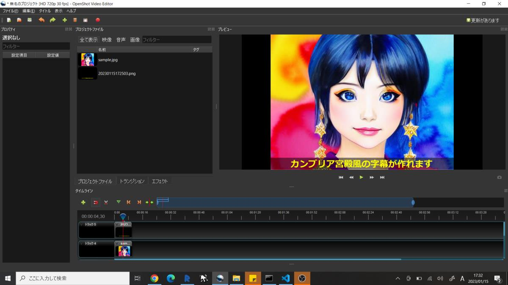

# Text_2_image

## 概要 (Overview)

字幕画像を生成するPythonスクリプトです。

字幕部分はBlackの半透過、それ以外は100%透過の.pngを生成します。

<使用例: OpenShot(動画編集アプリ)で画像に合成した例 >

## 動作要件 (Requirements)

Python3

## 使い方 (How to Use)

1. text2image.pyをPython3で起動

2. "Input text..." がプロンプトに表示されるので、表示したい文字列（文章）を入力し、Enter

3. imgフォルダに画像が生成されます。

＊ファイル名は時刻をもとに一意に設定されます。

＊文字サイズはソースを読み解いて設定してください

## 技術的解説 (Technical explanation)

https://s51517765.hatenadiary.jp/entry/2022/08/22/073000

## ライセンス (License)

This software is released under the MIT License, see LICENSE.
